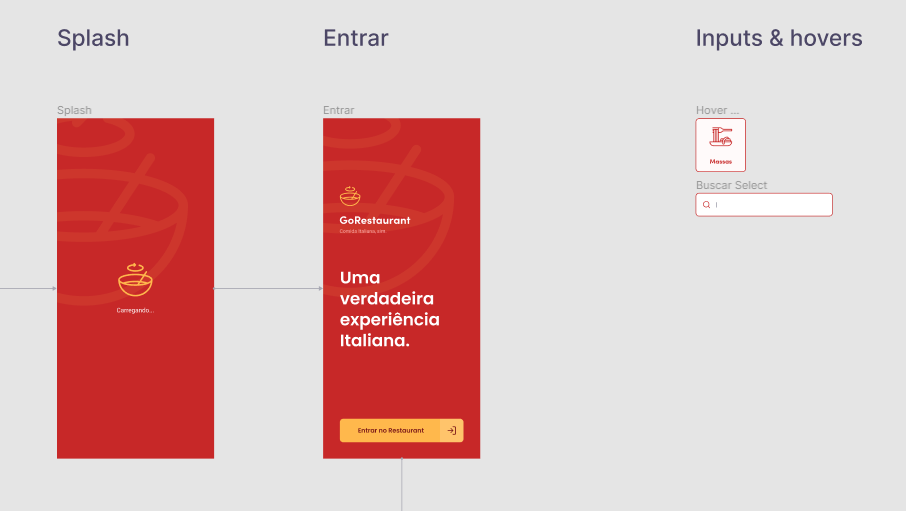
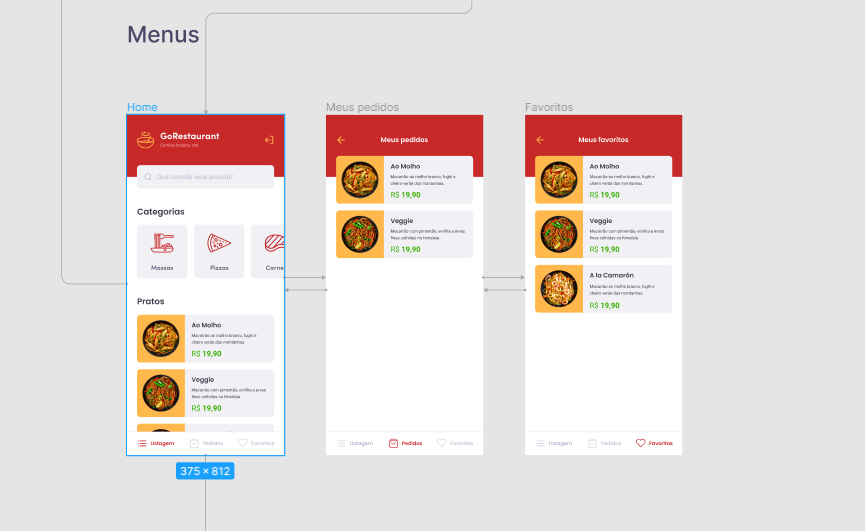
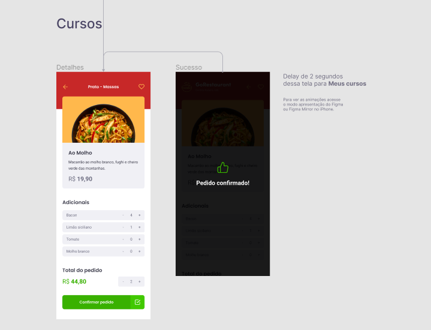

<h3 align="center">
  Desafio: GoRestaurant
</h3>

  

  

## :rocket: Sobre o desafio

Nesse desafio, você irá desenvolver mais uma aplicação, a GoRestaurant para o cliente.

Essa será uma aplicação que irá se conectar a uma Fake API, e exibir e filtrar os pratos de comida da API e permitir a criação de novos pedidos.

### Layout da aplicação

Essa aplicação possui um layout que você pode seguir para conseguir visualizar o seu funcionamento.

## :memo: Licença

Esse projeto está sob a licença MIT. Veja o arquivo [LICENSE](../LICENSE) para mais detalhes.

---

Feito com 💜 by Rocketseat :wave: [Entre na nossa comunidade!](https://discordapp.com/invite/gCRAFhc)
